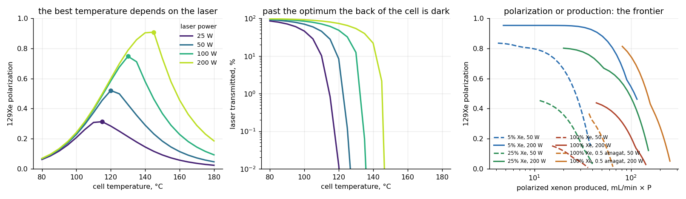
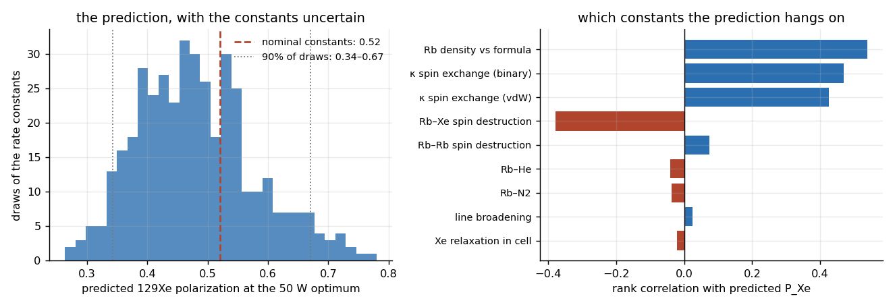
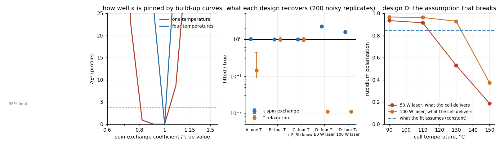
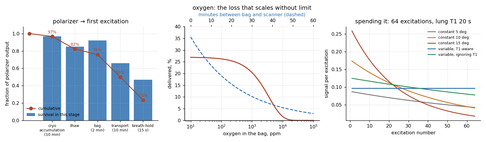
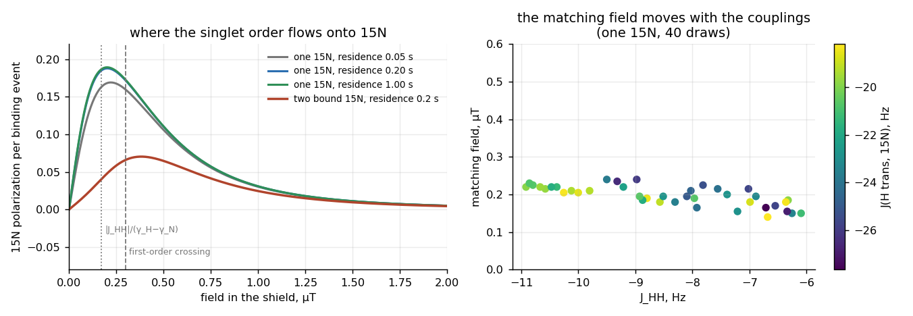
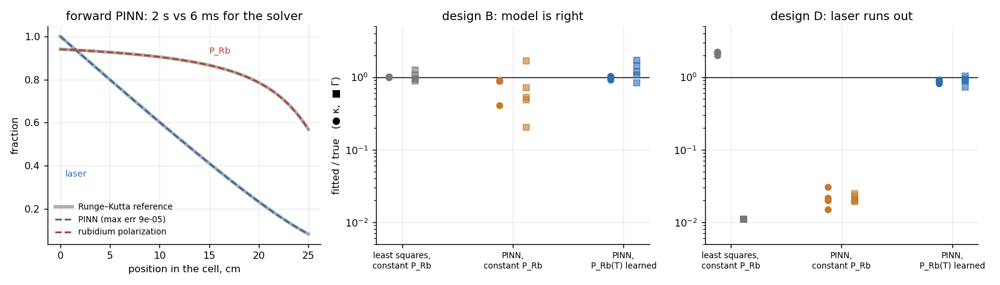

> **Scope, stated first.** No new measurements here. This is a set of
> physical models of gas hyperpolarization — spin-exchange optical pumping of
> 129Xe, and parahydrogen-based transfer to 15N — with every rate constant
> taken from the literature *as a range*, and the question asked of each model
> is not "what is the answer" but "what is the answer, how sure can we be of
> it, and which measurement would make us surer". Nothing here should be used
> to run a polarizer; it is for understanding why one behaves as it does.

# Hyperpolarization budget: where nuclear polarization is made, and where it goes

Hyperpolarized gases raise an NMR signal by four to five orders of magnitude,
and everything about them follows from one fact: the polarization is not
renewable. It is manufactured, at a rate set by a competition between
processes; it is then spent, by every surface, every oxygen molecule, every
field gradient and every radio-frequency pulse between the polarizer and the
image. The review this repository grows out of ([*NMR Hyperpolarization
Techniques of Gases*, Chem. Eur. J. 2017](https://doi.org/10.1002/chem.201603884))
laid the methods side by side; this is the arithmetic that sits under them,
written down so that its assumptions can be seen and its sensitivities
measured.

Five questions, five models, and one physics-informed neural network.

---

## What came out

| # | Finding | Where |
|---|---------|-------|
| 1 | The right cell temperature is a property of the laser, not of xenon: the optimum moves from 115 °C at 25 W to 145 °C at 200 W, and past it the back of the cell is dark. | §1 |
| 2 | Polarization and production are a frontier, not a setting. At 200 W the same cell delivers 95% polarized xenon at 5 mL/min or 46% at 116 mL/min; dilute xenon at the same total pressure wins at every point of it. | §1 |
| 3 | With the rate constants uncertain by their published ranges, the predicted polarization at the nominal optimum is 0.52 with a 90% interval of **0.34 to 0.67**, and the largest single source of that spread is not a physical constant: it is the rubidium density in the cell relative to the vapour-pressure formula. | §2 |
| 4 | A build-up curve at one temperature cannot measure the in-cell relaxation rate at all, and no series of build-up curves can separate the spin-exchange coefficient from the rubidium density: the two enter only as a product, so a "measured" κ inherits the full uncertainty of n_Rb. | §3 |
| 5 | A temperature series taken with a laser that runs out of photons at the top of the range returns κ **2.2× too high** and Γ **100× too low**, with a reduced χ² of 120 that says so — if anyone looks. | §3 |
| 6 | Of the polarization leaving a polarizer, **23%** reaches the first excitation in a representative clinical chain; the lung itself costs the most (T1 ≈ 20 s from alveolar oxygen), transport time the next, and a leaking bag valve everything. | §4 |
| 7 | The SABRE-SHEATH matching field for a single bound 15N is 0.20 µT, 0.1 µT below the first-order level-crossing formula; a second bound substrate moves it to **0.38 µT**. The field an experiment finds is a statement about the structure of the complex. | §5 |
| 8 | A physics-informed network with an *unknown function* P_Rb(T) in the rate equation recovers κ to **0.88×** and Γ to 0.90× from the laser-starved series that a constant-P_Rb least-squares fit gets 2.2× and 0.01× wrong. Where the model is right, least squares is better (1.00 vs 0.97) — the network is a repair, not an upgrade. | §6 |

---

## 1. The operating point of a xenon polarizer

The whole polarizer is four rates. Rubidium vapour absorbs circularly
polarized light at a rate R set by the laser; it loses its electron
polarization at a rate Γ_SD set by collisions, above all with xenon; what it
keeps, P_Rb = R/(R + Γ_SD), it passes to xenon nuclei at a rate γ_SE
proportional to the rubidium density; and the xenon loses it again at a rate
Γ_Xe set by the walls. Along the cell the light is eaten by atoms it has not
yet polarized, so the back of the cell sees less than the front.

The left panel is the trade this creates. Heating the cell raises the
rubidium density, which raises γ_SE and shortens the time xenon needs — but
the same photons now have to polarize more atoms, and there comes a
temperature at which they cannot. The optimum is **115 °C for 25 W, 120 °C
for 50 W, 130 °C for 100 W, 145 °C for 200 W** (dilute mix, 5% Xe at 3
amagat, 1 standard litre per minute), and the middle panel shows what
happens past it: the transmitted laser fraction falls off a cliff and the
far half of the cell is polarizing nothing. A polarizer's temperature set
point is therefore not transferable between machines with different lasers,
and a laser that ages moves the optimum without anyone changing a setting.

The right panel is the other trade: residence time against throughput.
Every point on each curve is a (temperature, flow) pair that no other pair
beats on both axes at once. Two things are visible. **Dilute xenon
dominates**: at 200 W the 5% mix gives 88% polarization at 50 mL/min of
polarized xenon, the 25% mix 67%, pure xenon at the same 3 amagat 42% —
because the rubidium spin-destruction rate scales with the xenon density and
pure xenon costs 20× the photons per polarized spin. Pure xenon at low
pressure (0.5 amagat) recovers most of that and reaches the largest
production of all, which is the regime the high-throughput pure-xenon
polarizers work in. And **the frontier is steep at its knee**: going from
5 to 50 mL/min at 200 W costs 7 points of polarization; going from 50 to
116 costs 42.

---

## 2. How much of that survives the uncertainty in the constants

Every rate constant in §1 is a literature value, and each has a range: the
binary and van der Waals spin-exchange coefficients, four spin-destruction
coefficients, the pressure broadening of the D1 line, the in-cell xenon
relaxation, and — the one that is not a physical constant at all — the ratio
of the actual rubidium density to what a vapour-pressure formula and a
thermocouple predict, which in a real cell is anywhere from 0.5 to 1.6.

Drawing all nine from their ranges 400 times and recomputing the 50 W
operating point gives the left panel: nominal 0.52, median 0.47, **90% of
draws between 0.34 and 0.67**. That is the honest precision of a
first-principles prediction of polarizer performance, and it is why the
literature reports measured values and models are used for trends.

The right panel says where the spread comes from. The rubidium-density
factor leads (ρ = +0.54), then the two spin-exchange coefficients and the
Rb–Xe spin-destruction rate. The Rb–N2, Rb–He and Rb–Rb terms, the line
width and the wall relaxation barely register at this operating point:
improving those constants would not improve the prediction. The optimum
*temperature* is more robust than the polarization at it — median 125 °C,
90% interval 115–135 °C — which is the usual pattern: the location of an
optimum survives uncertainty better than its height.

---

## 3. What a build-up curve can measure, and what it cannot

The standard way to measure the rate constants is to watch the xenon
polarization build up in a sealed cell,

P(t) = P_∞ (1 − e^{−γt}),  P_∞ = P_Rb · κ n_Rb / (κ n_Rb + Γ),  γ = κ n_Rb + Γ,

and fit. One curve gives two numbers, P_∞ and γ; the model has three
unknowns, κ, Γ and P_Rb; and a fourth hides in n_Rb. Four designs, each
fitted to 200 noisy synthetic replicates (0.5% absolute + 3% relative noise,
16 time points):

| design | κ / true | Γ / true | P_Rb (true 0.85) | χ²/dof |
|---|---|---|---|---|
| A: one temperature (130 °C) | 1.02 [0.97, 1.08] | **not identifiable** | 0.83 | 1.0 |
| B: four temperatures (90–150 °C) | 1.00 [0.97, 1.03] | 0.99 [0.85, 1.15] | 0.85 | 1.0 |
| C: B + P_Rb known to ±0.08 | 1.00 [0.97, 1.03] | 0.99 [0.86, 1.13] | 0.85 | 1.0 |
| D: B with a 50 W laser | **2.23** [2.08, 2.41] | **0.01** | 0.28 | **123** |
| D: B with a 100 W laser | **1.58** [1.52, 1.65] | **0.01** | 0.51 | **76** |

**At one temperature Γ is invisible.** The Fisher information matrix is
singular in its direction; the fitted values in the
table are whatever the bounds allow. This is not a matter of noise — it is
that at 130 °C, γ_SE exceeds Γ by a factor of 30 and P_∞ ≈ P_Rb, so nothing
in the curve depends on Γ. The left panel shows the profile likelihood: with
one temperature the confidence region for κ is asymmetric and open on the
low side, because a smaller κ can be repaid by a smaller Γ.

**A temperature series identifies all three — and cannot identify the
fourth.** With four temperatures γ(T) has a slope and an intercept, and κ and
Γ separate cleanly. But the slope is κ × (n_Rb per degree), and if the true
rubidium density is f times the formula, the fit returns κ × f with no
residual to warn anyone: data generated with f = 0.6 and f = 1.6 fit
perfectly and return 0.60 and 1.60 of the true κ. Every spin-exchange
coefficient measured this way carries the uncertainty of the rubidium density
it was divided by, which is the factor of 1.5–2 seen between published values.

**Design D is the one that happens.** The fit assumes P_Rb is the same at
every temperature. The right panel shows what a 50 W and a 100 W laser
actually deliver across the series from the model of §1: near-complete at
90 °C, 0.19 and 0.37 at 150 °C. Fitting a constant P_Rb to those curves
returns κ 2.2× (or 1.6×) too high and Γ two orders of magnitude too low,
because the only way the model can make P_∞ fall with temperature is to
invent relaxation. The reduced χ² of 76–123 flags it unambiguously — the
misspecification *is* visible in the residuals — but only to someone who
computes it.

---

## 4. From the polarizer to the image

A representative clinical chain for 129Xe: ten minutes of cryogenic
accumulation (xenon ice at 77 K, T1 2.5 h), a thaw (15% loss), two minutes in
a polymer bag (wall T1 40 min, 500 ppm residual oxygen), ten minutes of
transport in the Earth's field with a 1 µT/cm gradient, and a 15 s breath-hold
in a lung whose alveolar oxygen gives the gas a T1 of about 20 s.

| stage | duration | T1 | survives | cumulative |
|---|---|---|---|---|
| cryogenic accumulation | 10 min | 2.5 h | 0.97 | 0.97 |
| thaw | 30 s | — | 0.85 | 0.82 |
| bag | 2 min | 25 min | 0.92 | 0.76 |
| transport | 10 min | 24 min | 0.66 | 0.50 |
| inhalation and breath-hold | 15 s | 20 s | 0.47 | **0.23** |

**Less than a quarter of what leaves the polarizer is there for the first
excitation**, and the ranking of the losses is not the ranking of the effort
usually spent on them. What a single change buys:

| change | delivered | vs baseline |
|---|---|---|
| breath-hold 8 s instead of 15 | 33% | ×1.42 |
| transport 2 min instead of 10 | 33% | ×1.40 |
| coated glass instead of a bag | 30% | ×1.28 |
| skip the cryogenic step | 29% | ×1.22 |
| bag oxygen 50 ppm instead of 500 | 27% | ×1.13 |
| thaw loss 5% instead of 15% | 26% | ×1.12 |
| transport in a 1 mT carrier | 24% | ×1.01 |
| transport 30 min | 10% | ×0.43 |
| 5 µT/cm gradient during transport | 17% | ×0.71 |
| bag oxygen 2% (a leaking valve) | 0.1% | ×0.005 |

The middle panel is the oxygen curve: flat below a few hundred ppm, then a
cliff, because 0.388 s⁻¹ per amagat of O2 turns 1% oxygen into a 4-minute
T1 and 2% into a 2-minute one. It is the only loss in the chain with no floor.
The magnetic carrier, often the most visible piece of transport hardware,
buys 1% here — xenon diffuses slowly enough that gradient relaxation in the
Earth's field is a 12-hour T1 at 1 µT/cm — and matters only when gradients
are large or the gas is helium-diluted.

The right panel is the imaging end. Sixty-four excitations in a 20 s lung:
a constant 15° flip spends the magnetization on the first lines and leaves
7% of the first signal for the last, which is an apodization of k-space
that blurs the image; the variable schedule tan αₙ = E sin αₙ₊₁, run
backwards from 90°, returns exactly equal signal from every line at a
slightly lower mean. Ignoring T1 in that schedule costs a 38% droop across
the acquisition — small next to the losses upstream, which is the point of
putting the two on one page.

---

## 5. Where parahydrogen order becomes 15N polarization

The 15N route is different chemistry and the same accounting. Parahydrogen
is a singlet and carries no polarization, only order; in SABRE the iridium
complex holds the two hydrides and the substrate's 15N together, and the
hydride *trans* to the nitrogen couples to it (J ≈ −24 Hz) while the *cis*
one barely does. That asymmetry lets singlet order flow — but only at a field
where the singlet–triplet gap J_HH matches the proton–nitrogen Zeeman
difference (γ_H − γ_N)B, which for J_HH ≈ −8 Hz is a fraction of a
microtesla. The magnetic shield in SABRE-SHEATH exists to get there.

The model is the smallest one that has the effect: two hydrides and one
15N (an 8-state quantum system), the complex living for an exponentially
distributed time before the substrate leaves with whatever 15N polarization
it has. The residence-time average is done in closed form in the
Hamiltonian's eigenbasis; a time-grid version was tried first and aliased
above 0.7 µT.

- **The matching field is 0.20 µT**, not the 0.17 µT of |J_HH|/(γ_H − γ_N)
  and not the 0.30 µT of the first-order level crossing
  (−J_HH − (J_aN + J_bN)/4)/(γ_H − γ_N). The resonance is broad (FWHM 0.5 µT)
  because the mixing element is a quarter of the coupling that sets the
  crossing, and its peak is shifted by that mixing.
- **Per binding event, 19% 15N polarization** with equal-strength couplings
  to both hydrides giving **exactly zero** — the asymmetry is the whole
  mechanism.
- **A second bound substrate moves the field to 0.38 µT** and halves the
  polarization per nitrogen, since the singlet is shared. The experimental
  optimum most often reported for pyridine-type substrates, around 0.4 µT,
  is the two-substrate number: the field is diagnostic of the complex.
- With J_HH drawn from −11 to −6 Hz and the trans coupling from −28 to −18,
  the matching field stays within 0.14–0.24 µT; residence time between 50 ms
  and 1 s changes the peak height by 10% and its position by 0.02 µT.

This is the physics behind the 15N-labelled nicotinamide made for
parahydrogen hyperpolarization in
[Bioconjugate Chem. 2016](https://doi.org/10.1021/acs.bioconjchem.6b00148):
the label is worth having only if there is a field at which order reaches
it, and the model says where that field is and how forgiving it is.

---

## 6. Where a physics-informed network earns its place

The rate models above are cheap to solve exactly, so a neural network is not
needed to solve them, and the left panel says so: a network trained only on
the residual of the light-attenuation equation reproduces the Runge–Kutta
solution of §1 to 10⁻⁴ in the laser flux and 10⁻⁵ in the rubidium
polarization — in 2 seconds against 6 milliseconds. That is the honest
scoreboard for a forward PINN on a one-dimensional ODE.

The inverse problem is where it changes something. The network takes
(t, T) → P, with P(0) = 0 built in, and the rate equation

dP/dt = κ n_Rb(T) · (P_Rb − P) − Γ P

as a residual with κ and Γ trainable. The rubidium polarization is either
one trainable constant — exactly the assumption of the least-squares fit in
§3 — or a small network P_Rb(T) that the physics is free to fill in.

| design | method | κ / true | Γ / true |
|---|---|---|---|
| B: model is right | least squares, constant P_Rb | **1.00** [1.00, 1.02] | 0.95 [0.88, 1.25] |
| B | PINN, constant P_Rb | 0.88 [0.41, 0.91] | 0.53 [0.20, 1.66] |
| B | PINN, P_Rb(T) learned | 0.97 [0.91, 1.04] | 1.19 [0.84, 1.69] |
| D: 50 W laser runs out | least squares, constant P_Rb | 2.20 [2.00, 2.25] | 0.01 |
| D | PINN, constant P_Rb | 0.02 | 0.02 |
| D | PINN, P_Rb(T) learned | **0.88** [0.81, 0.93] | **0.90** [0.73, 1.04] |

Five noisy replicates each; brackets are the range.

Three things follow, and the first is against the network. **When the model
is right, least squares wins.** It recovers κ to 1% and the constant-P_Rb
PINN to 12%, with one replicate at 0.41: a soft physics residual is a worse
curve-fitter than an exact one, and nothing about "physics-informed" changes
that.

**When the model is wrong in the way real experiments are wrong, the
network with a function slot is the only one of the three that returns a
usable answer.** The laser-starved series of §3 makes the plateau fall with
temperature; a constant P_Rb can only explain that by inventing relaxation
(Γ → 0.01, κ → 2.2). The PINN with the same constant does worse still — it
fits the data with the network and lets the physics loss go where it likes.
The PINN with P_Rb(T) learned gets κ to 0.88 and Γ to 0.90, because the
rate information lives in the time constant γ(T) = κ n_Rb(T) + Γ, which the
residual enforces at every collocation point, and not in the plateau, which
P_Rb(T) is free to absorb.

**The repair costs precision.** 0.88 is not 1.00, and the range is wider.
A network with an unknown function in it is the tool for a model you know
to be incomplete, not a replacement for a fit you trust.

---

## Verification

Fourteen checks, all passing (two need PyTorch and are skipped without it):

- the rubidium density is in the known range (≈10¹³ cm⁻³ at 100 °C, 10¹⁴
  at 150 °C) and monotonic; 1 W at 795 nm is 4.0×10¹⁸ photons/s
- **photon conservation along the cell**: photons absorbed equal rubidium
  spins destroyed, integrated over the cell, to 2% — the ODE encodes the
  steady-state balance rather than assuming it
- in the thin-cell limit the laser passes and P_Rb = R/(R + Γ_SD) exactly
- the xenon build-up starts at zero and saturates at P_Rb γ_SE/(γ_SE + Γ)
- the build-up fit recovers κ, Γ and P_Rb from noise-free data to 1–2%
- alveolar oxygen gives the lung a T1 between 15 and 25 s
- the accumulation average lies between the survival of the first atom in
  and the last; the variable flip-angle schedule gives equal signal from
  every excitation (to 10⁻¹²) with and without T1, and reduces to
  arctan(1/√(N − n)) without it
- SABRE transfer is zero at zero field and zero with symmetric couplings;
  the closed-form residence average matches a 20 000-point time integral;
  the 15N polarization never exceeds 1 in the four-spin system
- the forward PINN matches the Runge–Kutta cell profile to 10⁻³; the
  inverse PINN's hard constraint P(0) = 0 holds exactly

---

## What this does not show

- **Rate constants are literature-typical, not measured here.** They are
  used only as ranges, and the conclusions that survive the ranges (§2) are
  the ones offered.
- **No thermal runaway, no laser heating, no rubidium condensation on the
  windows** — the effects that make a real cell's temperature a moving
  target. The models are steady-state and one-dimensional.
- **The delivery chain is one representative chain.** A different route
  (direct dispense, continuous flow to the scanner, helium-diluted delivery)
  has different numbers; the point is the method of accounting, and every
  stage is an argument.
- **Three and four spins.** A real SABRE complex has more coupled nuclei and
  chemical exchange on both the hydride and substrate sides; the model gives
  the location and shape of the resonance, not an absolute polarization.
- **No image.** The flip-angle panel is a signal-per-excitation curve, not a
  reconstruction; the k-space consequence is stated, not simulated.
- **Five replicates per PINN configuration**, not two hundred: each fit is
  a few minutes of training. The ranges are ranges, not confidence
  intervals.

---

## Source code

The core of this repository is public, in `src/`:

| file | what it is |
|---|---|
| `seop.py` | the four-rate SEOP model: rubidium density, D1 cross-section, spin destruction, spin exchange, laser attenuation along the cell, flow-through polarization |
| `exp2_identifiability.py` | build-up model, least-squares fit, Fisher information and profile likelihood, the four designs |
| `exp4_sabre.py` | n-spin SABRE-SHEATH dynamics with the closed-form residence average |
| `exp5_pinn.py` | the forward cell PINN and the inverse build-up PINN with the learned P_Rb(T) (PyTorch) |
| `tests/test_all.py` | the fourteen checks above |

`python3 tests/test_all.py` runs in under a minute; `exp5_pinn.py` needs
PyTorch and a few minutes of CPU.

**Not public:** the polarization–production frontier and Monte Carlo
sweeps (exp1), the staged delivery budget (exp3) and the figure scripts —
these carry operating-point choices that belong to ongoing work and are
available under NDA. Every number they produce is in `results/`.

---

## Licence and credit

Documentation and figures: CC BY 4.0. The rate constants belong to the
groups that measured them, and are cited in the review linked above.
